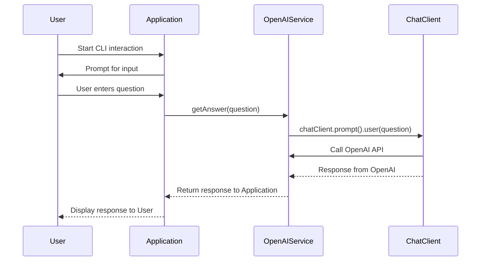

#  Spring AI CLI application integrated with CodeGate for Privacy
This project is an expiremental application that integrates [Spring AI](https://spring.io/projects/spring-ai) (Java AI Framework) and [Codegate](https://github.com/stacklok/codegate) (transparent AI gateway providing Personally identifiable information protection). Spring Boot-based chat application leverages OpenAI's API for generating responses to user prompts while CodeGate ensures senstive information (e.g. email address, credit cards) aren't sent to OpenAI. 

## Functionality Summary
- **Interactive Chat**: Users can input questions or commands via the console and receive formatted responses from an AI assistant.
- **OpenAI Integration**: Utilizes OpenAI's GPT-4 models for generating high-quality answers through a Spring Boot service layer.
- **Privacy Focus**: The application is designed to operate with a strong emphasis on user privacy and data security leveraging CodeGate.

## Sequence Diagram (Mermaid)



### Component Interactions
1. **User** sends a message to the `ChatController`.
2. **ChatController** processes the request and delegates it to `OpenAIServiceImpl`.
3. `OpenAIServiceImpl` uses `ChatClient` to generate an AI response.
4. The response is sent back to the user via the console or stream.

## Getting Started

Follow these steps to clone and run this project locally:

### Prerequisites

- Java 17 or higher
- Maven 
- An OpenAI API key

### Clone the repository

```bash
git clone https://github.com/yourusername/sample.git
cd sample
```

### Setup Configuration

1. Create a file named `application.properties` in the `src/main/resources` directory, and add your OpenAI API key:

```
spring.ai.openai.api-key=YOUR_OPENAI_API_KEY
```

### Build the Project

Run the following command to build the project:

```bash
mvn clean install
```

### Run the Application

You can run the application using the command:

```bash
mvn spring-boot:run
```

### Access the CLI

Once the application is running, open a terminal window and interact with the AI assistant by asking questions in the prompt provided in the CLI.

### Contribute

Feel free to fork the repository, make improvements or report issues.

---

For more information on setting up Spring Boot applications or managing dependencies with Maven, refer to the [Spring Boot Documentation](https://docs.spring.io/spring-boot/docs/current/reference/htmlsingle/) and [Maven Documentation](https://maven.apache.org/guides/index.html).
```

### via Command Line
1. Start the application.
2. Input your first question when prompted.

