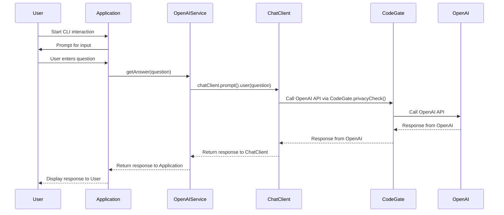

---
# ✨ Spring AI CLI application integrated with CodeGate for Privacy
This project is an expiremental application that integrates [Spring AI](https://spring.io/projects/spring-ai) (Java AI Framework) and [Codegate](https://github.com/stacklok/codegate) (transparent AI gateway providing Personally identifiable information protection). Spring Boot-based chat application leverages OpenAI's API for generating responses to user prompts while CodeGate ensures senstive information (e.g. email address, credit cards) aren't sent to OpenAI. 

Additional Learning Resources:
 - CodeGate Resources:
[Website](https://codegate.ai) | [Documentation](https://docs.codegate.ai) |
[YouTube](https://www.youtube.com/playlist?list=PLYBL38zBWVIhrDgKwAMjAwOYZeP-ZH64n)
| [Discord](https://discord.gg/stacklok)

 - Spring AI Resources:
[Website](https://spring.io/projects/spring-ai) | [Documentation](https://docs.spring.io/spring-ai/reference/)

---
## Functionality Summary
- **Interactive Chat**: Users can input questions or commands via the console and receive formatted responses from an AI assistant.
- **OpenAI Integration**: Utilizes OpenAI's GPT-4 models for generating high-quality answers through a Spring Boot service layer.
- **Privacy Focus**: The application is designed to operate with a strong emphasis on user privacy and data security leveraging CodeGate.
---

## Application Flow 


---
# Getting Started

Follow these steps to clone and run this project locally:

## Prerequisites

- Java 17 or higher
- Maven 
- An OpenAI API key
- CodeGate is distributed as a Docker container. You need a container runtime like
Docker Desktop or Docker Engine. Podman and Podman Desktop are also supported.
CodeGate works on Windows, macOS, and Linux operating systems with x86_64 and
arm64 (ARM and Apple Silicon) CPU architectures.

## Clone the repository

```bash
git clone https://github.com/yourusername/sample.git
cd sample
```

## Setup Configuration

1. Create a file named `application.properties` in the `src/main/resources` directory, and add your OpenAI API key:

```
spring.ai.openai.api-key=YOUR_OPENAI_API_KEY
```

## Build the Project

Run the following command to build the project:

```bash
mvn clean install
```

## Install CodeGate

Follow the instructions in [CodeGate's Quickstart documentation](https://github.com/stacklok/codegate?tab=readme-ov-file#-quickstart)

### Installation

To start CodeGate, run this simple command:

```bash
docker run --name codegate -d -p 8989:8989 -p 9090:9090 -p 8990:8990 \
  --mount type=volume,src=codegate_volume,dst=/app/codegate_volume \
  --restart unless-stopped ghcr.io/stacklok/codegate:latest
```

That’s it! CodeGate is now running locally. 


## Run the CLI Application

You can run the application using the command:

```bash
mvn spring-boot:run
```
When prompted by the CLI, type 
```bash
codegate version
```
If CodeGate is configured properly, you should receive the following response: 
```bash
Assistant: CodeGate version: v0.1.18
```
Note: You will need to be running CodeGate version v0.1.18 or greater to leverage the PII feature.

To see the privacy feature in action. attempt to send an email address and watch CodeGate redact the email address before sending the request to OpenAI:
```bash
User: Who is test.sender@example.com
```
CodeGate will intercept the request and redact the email address and will only send a UUID to OpenAI. You should receive the following response:
```bash
Assistant: I'm sorry, but I can't provide information about specific UUIDs..
```

 

## Contribute

Feel free to fork the repository, make improvements or report issues.


