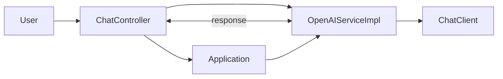

#  Spring AI CLI application integrated with CodeGate for Privacy
This project is an expiremental application that integrates [Spring AI](https://spring.io/projects/spring-ai) (Java AI Framework) and [Codegate](https://github.com/stacklok/codegate) (transparent AI gateway providing Personally identifiable information protection). Spring Boot-based chat application leverages OpenAI's API for generating responses to user prompts while CodeGate ensures senstive information (e.g. email address, credit cards) aren't sent to OpenAI. 

## Functionality Summary
- **Interactive Chat**: Users can input questions or commands via the console, receiving formatted responses from an AI assistant.
- **Streaming capability**: Enables continuous output of AI responses as they are generated, enhancing user interaction flow.
- **Integration with OpenAI**: Utilizes OpenAI's GPT-4 models for generating high-quality answers through a Spring Boot service layer.

## Sequence Diagram (Mermaid)



### Component Interactions
1. **User** sends a message to the `ChatController`.
2. **ChatController** processes the request and delegates it to `OpenAIServiceImpl`.
3. `OpenAIServiceImpl` uses `ChatClient` to generate an AI response.
4. The response is sent back to the user via the console or stream.

## Getting Started

### 1. Clone the Repository
```bash
git clone https://github.com/yourusername/ai-chat-project.git
cd ai-chat-project
```

### 2. Set Up Dependencies
- Ensure you have Java Development Kit (JDK) installed.
- Use either Maven or Gradle for dependency management.

### 3. Configure OpenAI Settings
1. Create a file `application.properties` in the project root with the following content:
```properties
spring.application.name=ai-chat-app
spring.threads.virtual.enabled=true

## OpenAI Configuration
spring.ai.openai.base-url=http://localhost:8989/openai
spring.ai.openai.api-key=${OPENAI_API_KEY}
spring.ai.openai.chat.options.model=gpt-4o-mini
```

### 4. Install Tools
- Spring Boot Toolchain (Maven or Gradle)
- OpenAI Java API Client

### 5. Run the Application
```bash
mvn spring-boot:run
```

## Usage Guide

### via Command Line
1. Start the application.
2. Input your first question when prompted.

